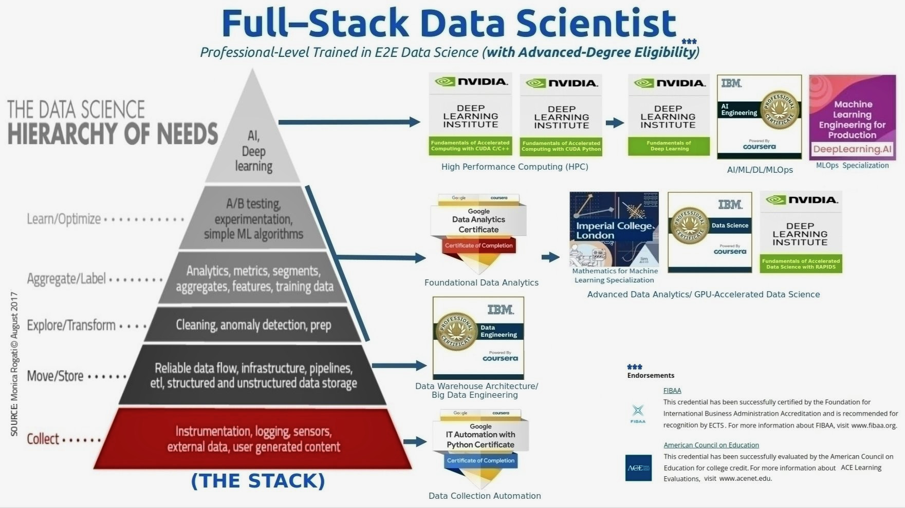

# Full-Stack Data Science

> "Learning is the source of human progress. It has the power to transform our world from illness to health, from poverty to prosperity, from conflict to peace. It has the power to transform our lives—for ourselves, for our families, and for our communities. No matter who we are or where we are, learning empowers us to change, grow, and redefine what's possible." -Anonymous-

This comprehensive training program emphasizes "real-world experiences" through "multiple capstone projects". It provides professional-level education in end-to-end data science (E2EDS), delivered by a research university and leading tech companies specializing in GPU-Accelerated Computing, Data, AI, and Automation. The program also provided "eligibility for advanced degrees".

The curriculum is structured around Monica Rogati’s "The Data Science Hierarchy of Needs", ensuring a solid foundation in data science principles and their practical applications:

## Trainings and Education:

    

## NVIDIA Deep Learning Institute
- **Non-Degree**  
Advanced Technical Workshops in "GPU-Accelerated" Generative AI, Data Science and HPC (High Performance Computing)  
**2021 - Present**

- **Instructors:** NVIDIA Experts-led Training (GTC Live and Virtual) thru Nvidia DLI platform.
- **Completed Workshops:**
  - [Fundamentals of Accelerated Data Science (with RAPIDS)](https://learn.nvidia.com/certificates?id=57ca45fb64524175b574af4fafa21e11)
  - [Fundamentals of Deep Learning](https://learn.nvidia.com/certificates?id=ef77185931c546b481ba51840fdd8cfa)
  - [Fundamentals of Accelerated Computing with CUDA C/C++](https://learn.nvidia.com/certificates?id=d747aca4c5f9467cb46d785ed401c6ea)
  - [Fundamentals of Accelerated Computing with CUDA Python](https://learn.nvidia.com/certificates?id=bbfe2cfa7cee4ec995553febfcd1a033)
  - [Getting Started in AI with Jetson (Edge AI)](https://learn.nvidia.com/certificates?id=c2b5e792bba44971a17ab524d58fc9c8&trk)

**Skills:**  
Data Science · RAPIDS · Python (Programming Language) · C++ · CUDA · Pandas (Software) · NumPy · Matplotlib · Scikit-Learn · SciPy · PyTorch · TensorFlow · cuPy · cuDF · cuML · cuGraph

---

    

## Imperial College London
- **Non-Degree**  
[Imperial College London-trained in Machine Learning and Data Science Mathematics](https://www.coursera.org/account/accomplishments/specialization/certificate/7RY8S3CXD8E9)  

- **Instructors:** Imperial College London's Mathematics Professors from the Engineering & Mathematics Departments thru Coursera Learning Platform.

**Skills:**  
Linear Algebra · Multivariable Calculus · Principal Component Analysis · Python Programming Language · NumPy · Scikit-learn · Matplotlib · SciPy

---

    

## DeepLearning.AI - MLOps | Machine Learning Engineering for Production
- **Non-Degree**  
[DeepLearning.AI-trained in MLOps | Machine Learning Engineering for Production](https://www.coursera.org/account/accomplishments/specialization/certificate/JT96BFTD2X97)  

- **Instructors:** Andrew Ng (Google Brain Founder), Robert Crowe (Google TensorFlow Advocate), and Laurence Moroney (Google TensorFlow Advocate) thru Coursera Learning Platform.

**Skills:**  
TensorFlow · VertexAI · Google Cloud Platform (GCP) · Machine Learning Production Systems · Deployment Pipelines · Model and Data Pipelines · Concept Drift and Model Baseline · Feature Engineering · Monitoring and Maintenance · DevOps Practices · Human-Level Performance (HLP) · Project Scoping and Design

---

    

## IBM Training - AI & ML Engineering
- **Advanced-Degree Credits Eligible**  
[IBM Professionally-trained in AI/ML Engineering](https://www.credly.com/badges/029facfa-be3e-4016-b1d1-4070f9f8846c)  

- **Instructors:** IBM Experts-led Machine Learning & AI Engineering Professional Training thru Coursera Learning Platform.

**Skills:**  
Exploratory Data Analysis · Linear Algebra · Multivariable Calculus · Applied Probability · Statistics · Machine Learning · Pandas (Software) · Matplotlib · NumPy · SciPy · Scikit-Learn · Supervised Learning · Unsupervised Learning · Convolutional Neural Networks (CNN) · Recurrent Neural Networks (RNN) · Deep Learning · Computer Vision · OpenCV · Pillow · Keras · PyTorch · TensorFlow

---

    

## IBM Training - Data Science & Advanced Data Analytics
- **Advanced-Degree Credits Eligible**  
[IBM Professionally-trained in Data Science](https://www.credly.com/badges/5811b8ae-de5c-4907-88a5-d4d6d5fab0a9)

- **Instructors:** IBM Experts-led Data Scientist & Advanced Data Analytics Professional Training thru Coursera Learning Platform.

**Skills:**  
Analytical Skills · Data Governance · Exploratory Data Analysis · Linear Algebra · Multivariable Calculus · Probability · Statistics · Statistical Analysis · Hypothesis Testing · ANOVA · Python (Programming Language) · Jupyter Notebook · Pandas (Software) · NumPy · SciPy · Matplotlib · Seaborn · Folium · Flask · Data Science · Bokeh Visualization Library · Machine Learning · Scikit-Learn · Supervised Learning · Unsupervised Learning

---

    

## Google Career Certificates - Foundational Data Analytics
- **Advanced-Degree Credits Eligible**  
[Google Professionally-trained in Foundational Data Analytics ](https://www.credly.com/go/6Yln9QrsZlKYbZSgzeBeEA)

- **Instructors:** Google Experts-led Data Analytics Professional Training thru Coursera Learning Platform.

**Skills:**  
Analytical Skills· Data Analysis· Exploratory Data Analysis· Data Governance· Analytics· SQL· Excel· Tableau· BigQuery· R (Programming Language)· RStudio

---

    

## IBM Training - Data Warehouse & Big Data Engineering
- **Advanced-Degree Credits Eligible**  
[IBM Professionally-trained in Big Data Engineering](https://www.credly.com/badges/d2a32c7b-5b1e-4cd4-886c-3c3deeb6c78e)
                                                 
- **Instructors:** IBM Experts-led Data Warehouse Architecture & Big Data Engineering Professional Training thru Coursera Learning Platform.

**Skills:**  
Data Governance · Exploratory Data Analysis · Data Architecture · Data Engineering · Data Modeling · Data Warehouse Architecture · Principal Component Analysis · SQL · NoSQL · Python (Programming Language) · Cassandra · Scala · IBM Db2 · MySQL · PostgreSQL · MongoDB · Extract, Transform, Load (ETL) · Apache Airflow · Apache Kafka · Big Data · ELT · MapReduce · Hadoop · Machine Learning · Pandas (Software) · NumPy · Matplotlib · SciPy · Scikit-Learn · Apache Spark

---

    

## Google Career Certificates - IT Automation with Python
- **Advanced-Degree Credits Eligible**  
[Google Professionally-trained in IT Automation with Python](https://www.credly.com/badges/47116441-c734-4380-b36e-36c4eab41073)  

- **Instructors:** Google SREs-led IT Automation & Site Reliability Engineering Professional Training thru Coursera Learning Platform.

**Skills:**  
Python (Programming Language) · IT Automation · DevOps · Continuous Integration and Continuous Delivery (CI/CD) · Configuration Management · Git · GitHub · Puppet (Software) · Containerization · Kubernetes · Google Cloud Platform (GCP) · Google Kubernetes Engine (GKE)
